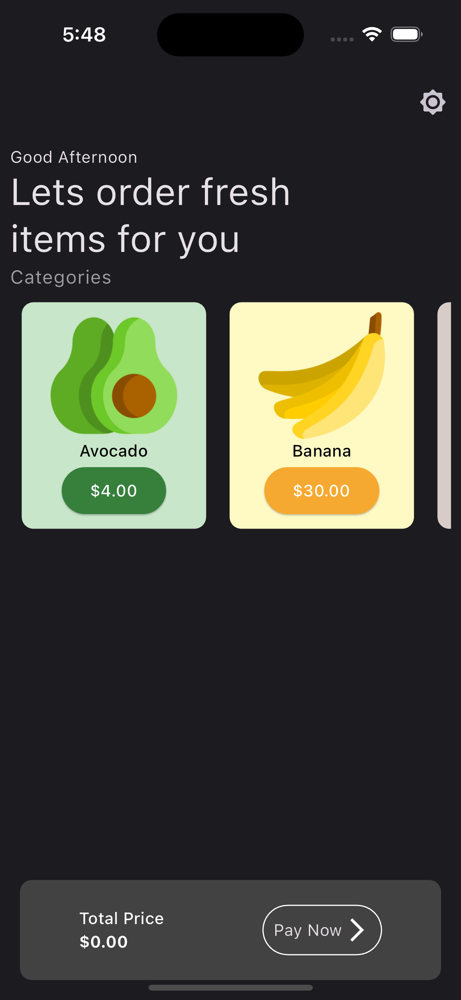
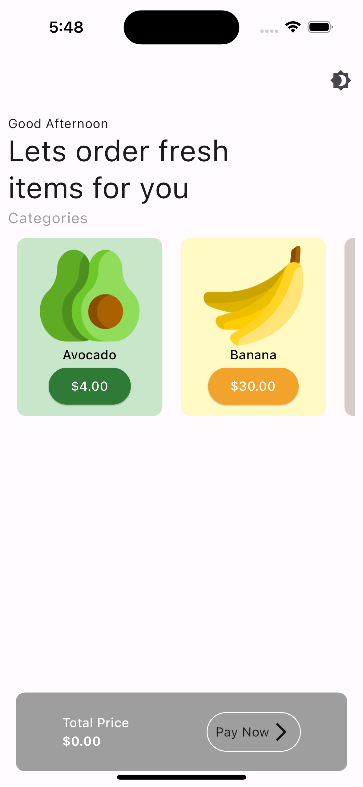
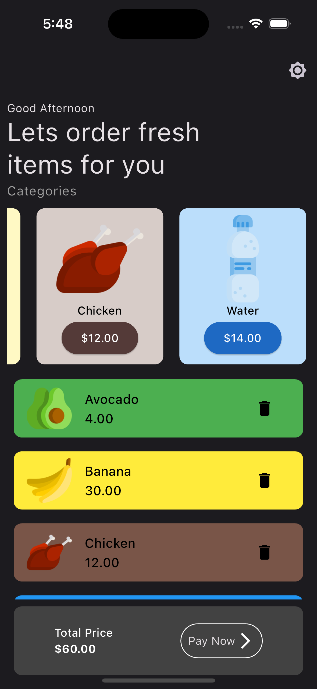
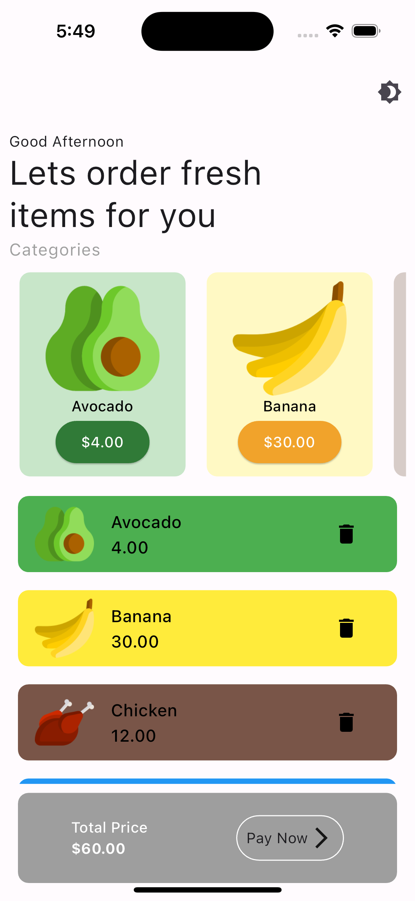

# Flutter Shop App UI

 

## Screenshots

  

     
    
  

   

     
    
  

   

     
     
  

- [Linkedin](https://www.linkedin.com/in/vural-kayra-cetintas/)
- [Github](https://github.com/vuralkayracetintas)
- [Instagram](https://www.instagram.com/vuralkayrac/)

## Packages
- [cupertino_icons](https://pub.dev/packages/cupertino_icons)

- [kartal](https://pub.dev/packages/kartal)

- [provider](https://pub.dev/packages/provider)