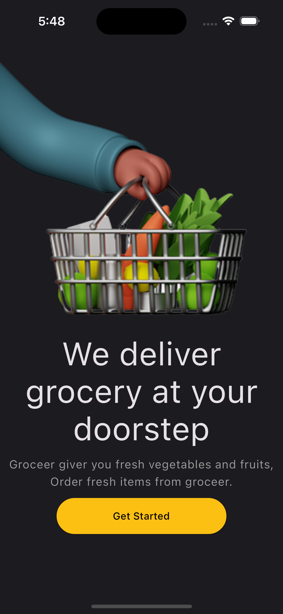
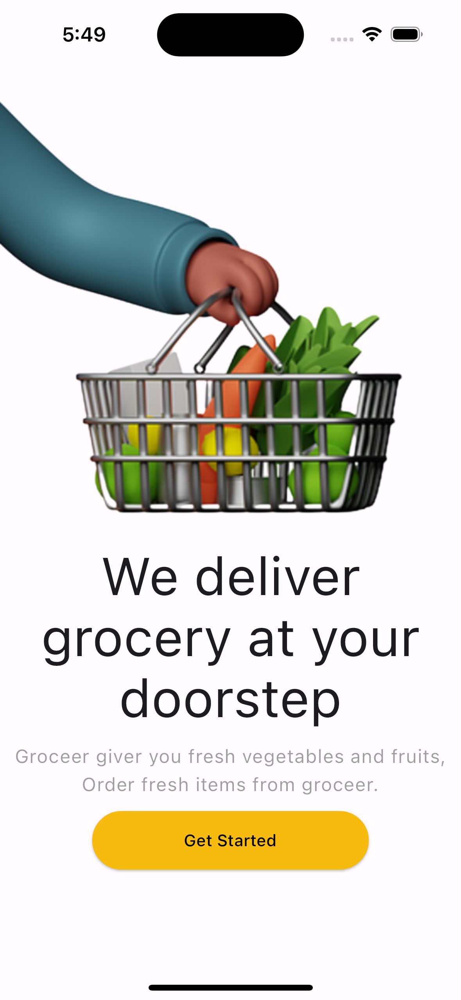

# Flutter Shop App UI

## Screenshots

  

    
  

  

    
  

    

    
  

  

    
  

    

    
  

  

    
  

This project is a starting point for a Flutter application.

A few resources to get you started if this is your first Flutter project:

- [Linkedin](https://www.linkedin.com/in/vural-kayra-cetintas/)
- [Github](https://github.com/vuralkayracetintas)
- [Instagram](https://www.instagram.com/vuralkayrac/)

## Packages
- [cupertino_icons](https://pub.dev/packages/cupertino_icons): 
- [google_nav_bar](https://pub.dev/packages/google_nav_bar):
- [kartal](https://pub.dev/packages/kartal):
- [font_awesome_flutter](https://pub.dev/packages/font_awesome_flutter): 
- [table_calendar](https://pub.dev/packages/table_calendar): 